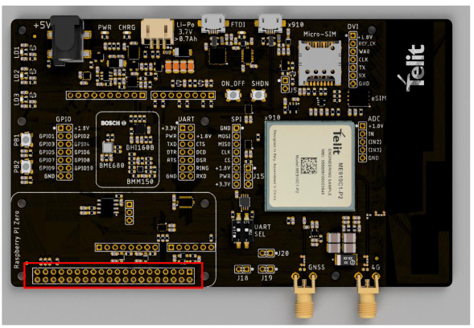
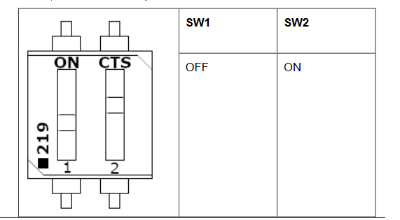

# Bravo Board - Raspberry Pi demo

A simple demonstrator showing communication between the Bravo board and a Raspberry Pi device

## Prerequisites

 - Please visit [Bravo Evaluation Kit page](https://www.telit.com/developer-zone/telit-bravo-evaluation-kit/) board and read *"Bravo Quick Start Guide"*. If you want to try the LwM2M demo or use Telit embedded connectivity SimWISE, please read also *"Bravo Getting Started OneEdge"*

## HW SETTINGS

 - Connect the Bravo board with the Raspberry Pi using the previously soldered Berg connectors (as reported in the [Bravo Quick Start Guide](https://y1cj3stn5fbwhv73k0ipk1eg-wpengine.netdna-ssl.com/wp-content/uploads/2020/10/Telit_Bravo_Quick_Start_Guide_r1.pdf) )

 - No external power is needed except for the Raspberry Pi's itself 

 - Bring a GPIO from 1.8V from the Bravo board and connect it to GPIO19 of the Raspberry Pi (this GPIO is used to monitor the status of the modem (ON/OFF) from the Raspberry Pi)

 - Set UART SEL dip switches as shown below:

 - Insert a SIM card without PIN number inserted or use the SimWISE profile as explained in *"Bravo Getting Started OneEdge"*

 - Power on the modem with the power button on the Bravo Board (hold for 5 seconds approx)

## SW SETTINGS

- Download the necessary files on a Directory in the Raspberry Pi (for example, in the Desktop folder as "Desktop/Bravo_Project")

    - Bravo_demo.py

    - settings.py

    - object_26250.xml

    - object_26251.xml

    - object_26242.xml

## Additional settings

In the `Bravo_demo.py` file there are some configurations to be done:

 - `APN = ""` set it based on your mobile operator APN (for SimWISE please use "NXT17.NET")

 - Enable/disable the example you want to run between **"echo_demo"** or **"lwm2m_demo"** inside the `main` function. For lwm2m_demo ensure you've read the *"Bravo Getting Started OneEdge"* thoroughly

## Execution

To run the demo, execute the `Bravo_demo.py` file

`./Bravo_demo.py`

it will automatically search the `settings.py` file (if needed any missing file among the required ones will be copied in the module) and the demo previously selected will be executed.

